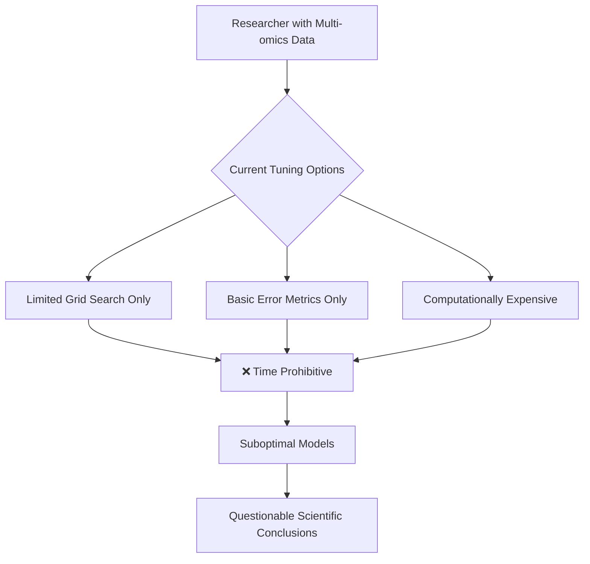
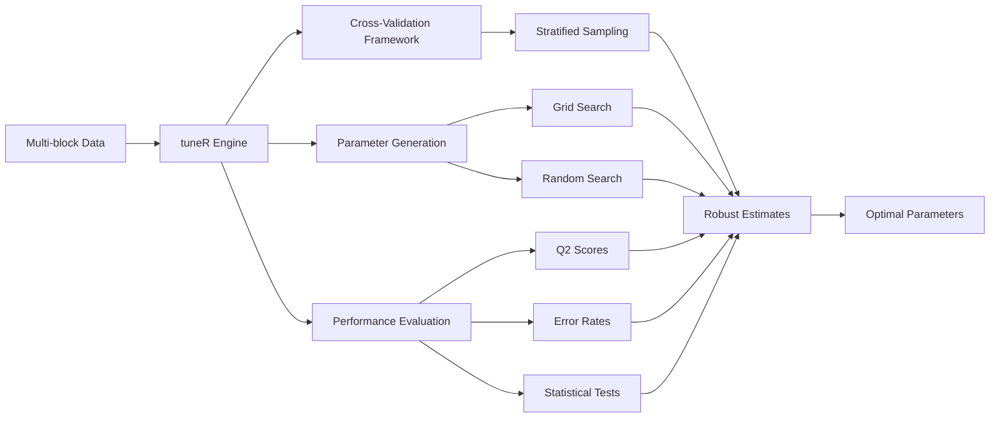
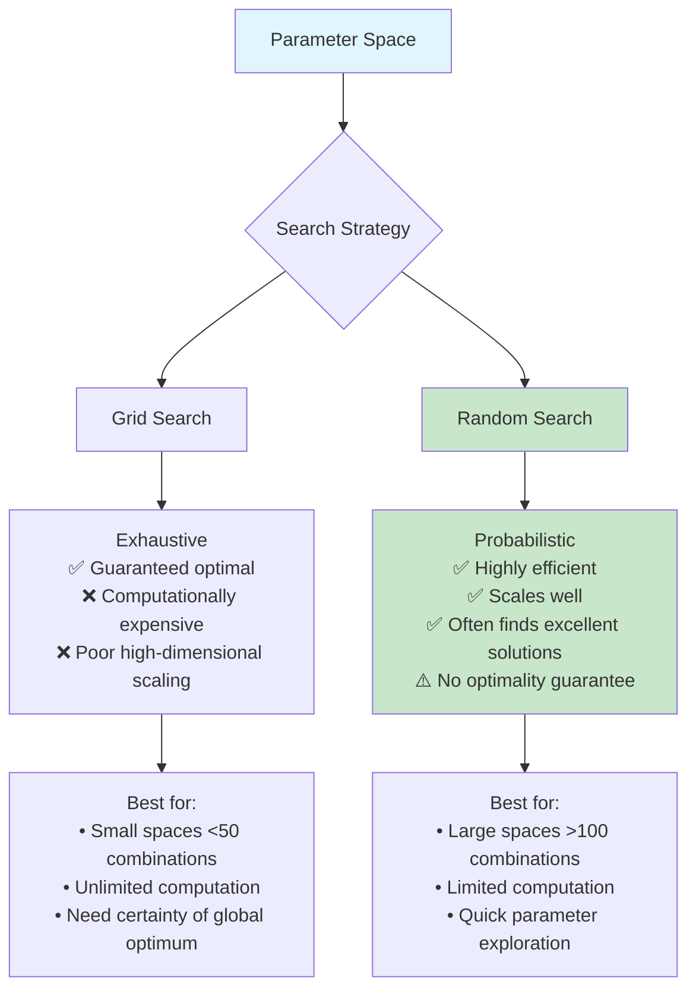
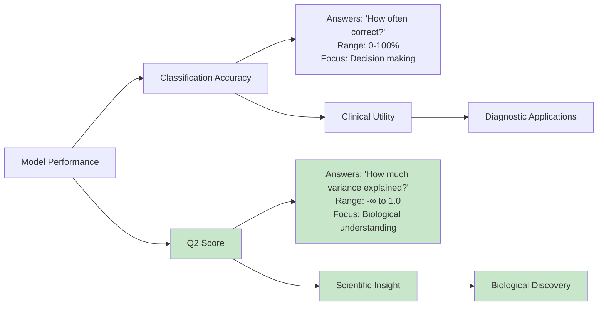
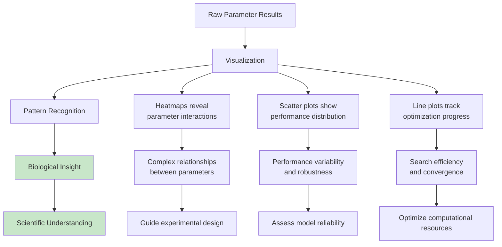
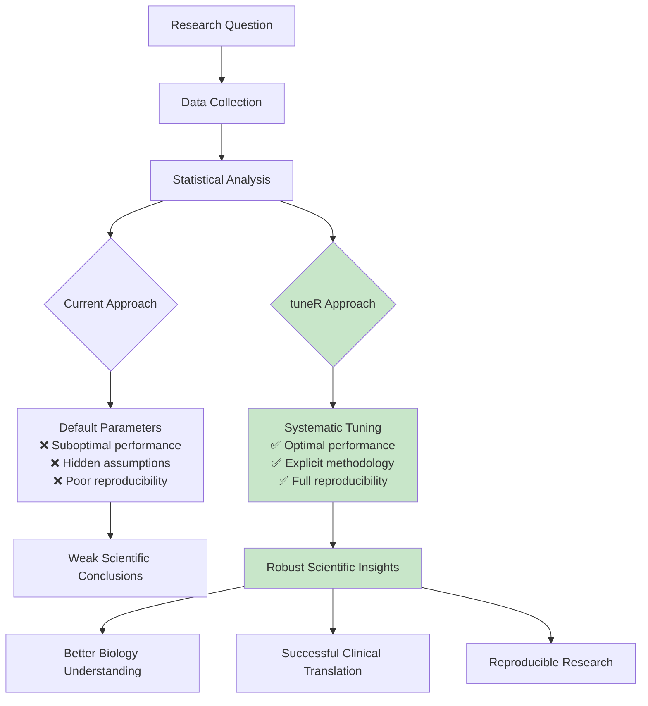

# Mermaid Diagrams for Medium Article

This file contains all the mermaid diagrams used in the Medium article for easy rendering and updating.

## 1. Problem Identification Workflow

## 2. tuneR Solution Architecture

## 3. Search Strategy Comparison

## 4. Performance Metrics Explanation

## 5. Visualization to Insight Pipeline

## 6. Scientific Workflow Impact

## Rendering Instructions

To render these diagrams:

1. **GitHub**: Copy the mermaid code blocks and paste into a GitHub markdown file or issue
2. **Mermaid Live Editor**: Go to https://mermaid.live and paste the code
3. **VS Code**: Use the Mermaid Preview extension
4. **Command Line**: Use mermaid-cli: `mmdc -i diagram.mmd -o diagram.png`

## Style Guide

- **Colors**:
  - Success/Positive: `#c8e6c9` (light green)
  - Info/Neutral: `#e1f5fe` (light blue)  
  - Problem/Negative: Default (no fill)
- **Typography**: Use clear, concise labels
- **Layout**: Prefer left-to-right flow for processes, top-down for hierarchies
- **Size**: Ensure readability at article width (~800px)
